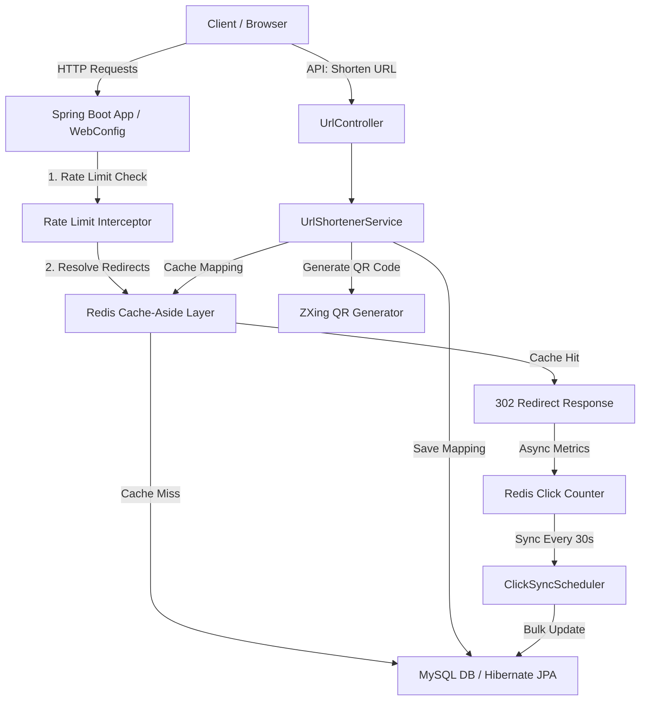

# 🚀 Production-Ready URL Shortener Service

A high-performance, resilient, and production-grade URL Shortening Service built using **Java 17/21**, **Spring Boot 3.x**, **MySQL**, and **Redis**.

This service features a highly optimized architecture, incorporating **write-behind caching** for click analytics, **resilient cache-aside** for URL redirects, **dynamic QR code generation**, **fixed-window rate limiting**, and **custom aliases with expiration dates**.

---

## 🏗️ System Architecture & Design Patterns



### ⚡ 1. Write-Behind Cache Synchronization (Analytics)
Incrementing a database column for every redirect creates a severe database write bottleneck. This service uses a **Write-Behind** strategy:
- Redirects are served instantly via a Redis Cache look-up.
- Click counts and last-access timestamps are logged and incremented instantly in Redis (`O(1)` performance).
- A background `ClickSyncScheduler` runs periodically (every 30 seconds) to extract accumulative click metrics from Redis and execute batch updates to MySQL, preventing database locking and overhead.

### 🛡️ 2. Resilient Cache-Aside Pattern
The caching layer is designed with a **fail-safe degradation mechanism**. If the Redis cluster goes offline:
- Redis operations fail silently, and errors are caught and logged.
- The service gracefully falls back to direct MySQL queries, ensuring 100% service availability.
- When Redis recovers, mappings are re-cached automatically.

### 🚦 3. IP-Based Rate Limiting
To prevent abuse and DDoS attacks:
- The `RateLimitInterceptor` intercepts all `/api/**` traffic.
- Each client IP is allowed **60 requests per minute**.
- Uses Redis for distributed rate-limiting, with a thread-safe in-memory cache fallback (`ConcurrentHashMap` of Token Buckets) if Redis is down.

---

## 📁 Project Structure

```
d:\Projects\url-shortener\
├── src/
│   ├── main/
│   │   ├── java/com/muni/demo/
│   │   │   ├── config/             # Redis, Swagger/OpenAPI, Web MVC, and Interceptors
│   │   │   ├── controller/         # REST Controllers (URLs, Redirects)
│   │   │   ├── dto/                # Request & Response Data Objects (ApiResponse envelope)
│   │   │   ├── entity/             # JPA Database Entities (UrlMapping)
│   │   │   ├── exception/          # Custom Exceptions & GlobalExceptionAdvice
│   │   │   ├── repository/         # JPA Spring Data Repositories
│   │   │   ├── service/            # Business logic (URL Shortener & ClickSyncScheduler)
│   │   │   ├── util/               # Base62 conversion, QR Code, and URL Validation
│   │   │   └── UrlShortApplication.java
│   │   └── resources/
│   │       ├── application.properties
│   │       └── ...
│   └── test/                       # Unit & Integration Tests (MockMvc, Mockito, H2 DB)
├── Dockerfile                      # Multi-stage Docker image definition
├── docker-compose.yml              # Local compose for App, MySQL, and Redis
└── pom.xml                         # Maven dependencies and build parameters
```

---

## 🛠️ Getting Started

### Prerequisites
* **Java 17** or **Java 21**
* **Maven 3.8+** or use `./mvnw`
* **Docker & Docker Compose** (Optional, but highly recommended)

### 🐋 Method 1: Running with Docker Compose (Recommended)
This boots up MySQL, Redis, and the Spring Boot application inside a unified virtual network:

```bash
# 1. Build and run all services
docker-compose up --build -d

# 2. Check the container health status
docker-compose ps
```

### 💻 Method 2: Running Locally
If you want to run the project locally, make sure you have local MySQL and Redis instances running.

1. **Configure Database & Redis**:
   Update your credentials in `src/main/resources/application.properties` or set environment variables:
   ```properties
   spring.datasource.username=root
   spring.datasource.password=yourpassword
   spring.data.redis.host=localhost
   spring.data.redis.port=6379
   ```

2. **Build the Project**:
   ```bash
   ./mvnw clean package
   ```

3. **Run the Application**:
   ```bash
   ./mvnw spring-boot:run
   ```

---

## 📖 REST API Documentation

Once the application is running, access the interactive Swagger/OpenAPI UI here:
👉 **[http://localhost:8080/swagger-ui.html](http://localhost:8080/swagger-ui.html)**

### Endpoints Overview

| Method | Endpoint | Description |
| :--- | :--- | :--- |
| **POST** | `/api/v1/urls` | Shorten a long URL |
| **GET** | `/{shortCode}` | Resolve short code & redirect (302) |
| **GET** | `/api/v1/urls` | List paginated short URLs |
| **GET** | `/api/v1/urls/{shortCode}/analytics` | Retrieve URL analytics |
| **GET** | `/api/v1/urls/{shortCode}/qrcode` | Get QR Code image directly (PNG) |
| **DELETE**| `/api/v1/urls/{shortCode}` | Delete shortened URL mapping |

---

### Request & Response Examples

#### 1. Shorten a URL
* **URL**: `/api/v1/urls`
* **Method**: `POST`
* **Payload**:
```json
{
  "originalUrl": "https://github.com/google/gemini-cookbook",
  "customAlias": "gemini-guide",
  "expiresAt": "2028-12-31T23:59:59"
}
```

* **Response (`201 Created`)**:
```json
{
  "success": true,
  "message": "URL shortened successfully",
  "data": {
    "originalUrl": "https://github.com/google/gemini-cookbook",
    "shortUrl": "http://localhost:8080/gemini-guide",
    "shortCode": "gemini-guide",
    "clickCount": 0,
    "createdAt": "2026-06-30T15:14:41.370",
    "expiresAt": "2028-12-31T23:59:59",
    "qrCodeBase64": "data:image/png;base64,iVBORw0KGgoAAAANS..."
  }
}
```

#### 2. Get Analytics
* **URL**: `/api/v1/urls/gemini-guide/analytics`
* **Method**: `GET`
* **Response (`200 OK`)**:
```json
{
  "success": true,
  "message": "Analytics retrieved successfully",
  "data": {
    "originalUrl": "https://github.com/google/gemini-cookbook",
    "shortCode": "gemini-guide",
    "clickCount": 42,
    "createdAt": "2026-06-30T15:14:41",
    "updatedAt": "2026-06-30T15:16:12",
    "lastAccessedAt": "2026-06-30T15:17:00",
    "expiresAt": "2028-12-31T23:59:59"
  }
}
```

#### 3. Error Handling Example (Rate Limit Exceeded)
* **Response (`429 Too Many Requests`)**:
```json
{
  "success": false,
  "message": "API rate limit exceeded. Max 60 requests per minute.",
  "data": null
}
```

---

## 🧪 Testing

The codebase includes a fully-configured test harness containing Unit and Integration tests. H2 database is configured specifically for test executions.

To run the entire test suite:
```bash
./mvnw test
```
Outputs and test coverages will be generated in `target/surefire-reports/`.

---

## 🎨 React Dashboard Frontend

A responsive React frontend UI is built using Vite, CSS glassmorphism, and Lucide React icons.

### Features
* **Link Shortening Form**: destination URL, custom alias (optional), and expiration timestamps.
* **Interactive Output Section**: shows success response, clipboards copier, and downloadable QR Code.
* **Recent Mappings Workspace**: shows paginated mappings list with status indicators (Active/Expired) and direct action buttons for Analytics, Copying, and Deletion.

### Running the Frontend Locally

1. Navigate to the `frontend` directory:
   ```bash
   cd frontend
   ```
2. Install npm packages:
   ```bash
   npm install
   ```
3. Start the development server:
   ```bash
   npm run dev
   ```
4. Access the web dashboard in your browser:
   👉 **[http://localhost:5173](http://localhost:5173)**

